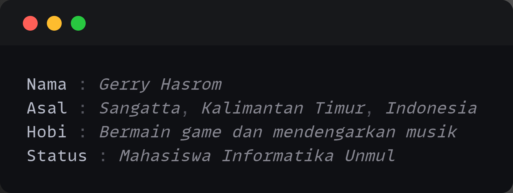

<table align="center">
  <tr>
    <td>
      
    </td>
    <td style="padding-left: 20px;">
      <h1 align="center">
        Hi 
        
        , I'm Gerry Hasrom
      </h1>
      <h3><b><i>Actions speak louder than words.</i></b></h3>
    </td>
  </tr>
</table>

  
  
  
  
  
  
  
  

---

  
   
  <b><i> Aku dan error di jam 3 pagi </i></b>

---
<h1 align="center"><b>Skills</b></h1>

<table align="center" cellpadding="10">
  <tr>
    <th>Category</th>
    <th>Skills</th>
  </tr>
  <tr>
    <td>Programming</td>
    <td>
       Python
       JavaScript
    </td>
  </tr>
  <tr>
    <td>Frontend</td>
    <td>
       HTML5
       CSS3
    </td>
  </tr>
  <tr>
    <td>Backend</td>
    <td>
       MySQL
       Firebase
       PHP
    </td>
  </tr>
  <tr>
    <td>Framework</td>
    <td>
       Flutter
    </td>
  </tr>
</table>

---

<h2 align="center"><b>About Me</b></h2>

  

---

<h1 align="center">🌐 Connect with Me</h1>

  
  
  
  
  
  

